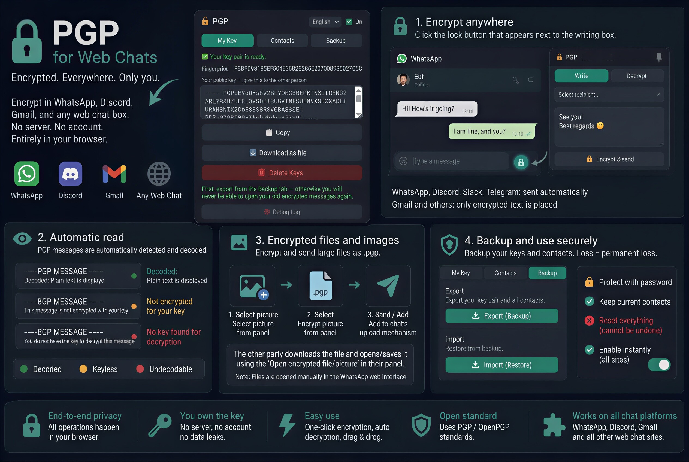

# PGP for Web Chats

A free, open-source browser extension that adds end-to-end PGP encryption to
**WhatsApp Web, Discord, Slack, Telegram Web, Gmail, and basically any web-based
chat box**. Everything runs locally in your browser — no server, no account,
no data collection of any kind.

Type your message, it gets encrypted before it's sent. The person on the other
end — running the same extension — sees the plain text automatically. Anyone
else watching the wire (the platform itself, an ISP, or anyone else with
access to the traffic) only ever sees ciphertext.

*Türkçe kurulum notu için [`BENIOKU.md`](./BENIOKU.md) dosyasına bakın.*

---

## Why this exists

Governments across the EU and elsewhere are moving forward with proposals —
commonly referred to as **"Chat Control"** — that would require scanning
private messages before they're encrypted, undermining end-to-end encryption
on the platforms billions of people already use every day. Regardless of the
stated intent, the effect is the same: a permanent, built-in way to inspect
private conversations that were never meant to be readable by anyone but the
people having them.

This extension isn't a legal or political fix, and it isn't a replacement for
purpose-built secure messengers like Signal. It's a small, practical
countermeasure: encrypt your messages with PGP *before* they ever reach the
platform's servers, on top of the chat apps you already use with the people
you already talk to. If a message is encrypted client-side, scanning the
platform's copy of it doesn't reveal anything.

## What it does

- Adds a 🔒 button next to any message box on any site
- Encrypts to a saved contact's public key, right in the page
- Automatically detects and decrypts incoming PGP messages
- Supports encrypted image/file attachments
- Optional password-protected local key storage (PBKDF2 + AES-256-GCM)
- No server, no telemetry, no account — everything stays on your device

Full setup and usage instructions are in [`README` usage section below](#how-to-use) after installing, or in [`help/help.html`](./help/help.html) inside the extension itself.

## Download / Install

This extension is not (yet) published on the Chrome Web Store, so it's
installed as an "unpacked" extension — this is completely normal for
open-source browser extensions and takes about a minute:

1. Click **Code → Download ZIP** on this page (or `git clone` the repo) and unzip it somewhere on your computer.
2. Open `chrome://extensions` (Chrome, Brave, Edge, and most Chromium-based browsers).
3. Turn on **Developer mode** (top right, Chrome-based browsers).
4. Click **Load unpacked** and select the unzipped folder.
5. Done — the 🔒 icon will appear in your toolbar.

To update later: download the new version, replace the folder, then click the
reload (↻) icon on the extension's card in `chrome://extensions`.

The interface is in English by default, with a Turkish option available from
the popup.

## How to use

1. **Create your key** — extension icon → **My Key** → **Generate Key**, then share your public key with the other person over any channel other than the chat itself (e.g. e-mail).
2. **Add a contact** — extension icon → **Contacts** → paste their public key.
3. **Write encrypted** — click any message box, a 🔒 button appears, pick a recipient and type. On WhatsApp/Discord/Slack/Telegram the encrypted text is sent automatically; on Gmail and other sites it's inserted for you to send manually.
4. **Reading** — encrypted messages on the page are detected and decrypted automatically, marked with a colored dot (🟢 decrypted, 🟡 not encrypted to your key, 🔴 no matching key).

See [`README`](./README.md) history and [`BENIOKU.md`](./BENIOKU.md) for the complete walkthrough, encrypted image handling, backup/restore, and known limitations.

## Known limits (please read)

- Messages are encrypted but **not signed** — this does not verify who sent a message.
- There's no built-in key-verification step — compare fingerprints over a trusted channel to guard against a swapped public key.
- Metadata (who is talking to whom, and when) is still visible to the platform — this tool only protects message content.
- This project has **not** been professionally security-audited. For high-stakes situations, use a dedicated, audited tool such as Signal or GnuPG directly.
- Web chat interfaces change often; if a site breaks, the selectors in `content/content.js` are the place to look.

Built on [OpenPGP.js](https://openpgpjs.org/) (LGPL), Curve25519 keys.

---

## Support this project

This extension is free, open-source, and always will be. If it's useful to
you, or you just want to support privacy tools like this one, you can buy me
a coffee here:

**☕ [Donate on Ko-fi](https://ko-fi.com/W7W2DP17Q)**

Every bit helps keep tools like this maintained and free for everyone.

## Contributing

Issues and pull requests are welcome — especially reports of chat sites where
the message-box detection breaks, or where the encrypted-file flow needs
adjusting for a specific platform's upload behavior.
